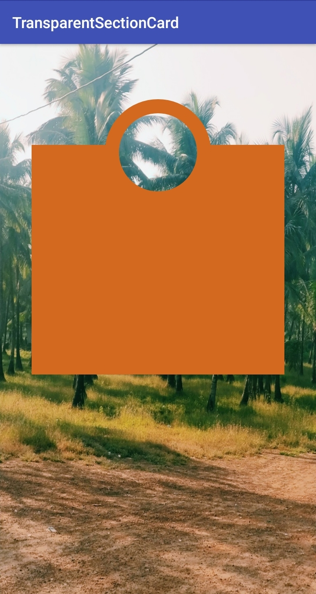

# TrasparentSectionCard
Creating a custom view with transparent sections.

This demo extends View class to create a view with transparent part. It uses the rectangles & circles for the view, one can use thier own ideas for different shapes.

This is how the result looks like in this demo.

 😍 Happy Coding 😍
